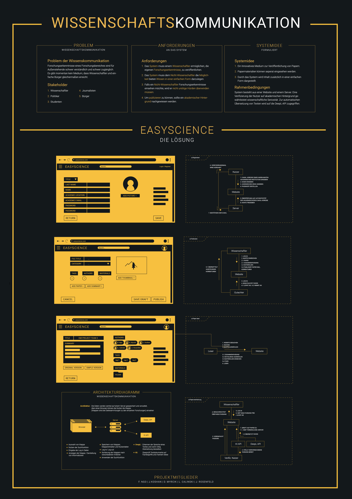

### Einleitung
Das Modul "Einführung in die Medieninformatik" ist 
ein Rundumschlag  in der  Medieninformatik und eine der ersten Veranstaltung die die angehenden
Medieninformatiker:innen besuchen. Viele besonders zentrale  Konzepte der Studiengangsmodule werden angerissen und zum Teil in Workshops
vermittelt.
Innerhalb der Projektwoche werden die theoretischen Inputs von den Studierenden in Projekte gegossen und präsentiert. 
Dabei soll
ein mensch-zentrierter, iterativer Gestaltungsansatz durchlaufen werden. 
 
 #### Thema
 Das Thema der Projektwoche war "Wissenschaftskommunikation"; ein Thema von hoher
  Komplexität. Ziel der Veranstaltung ist die theoretische Gestaltung einer
  Softwarelösung. Gefordert wird eine Problemanalyse, durchgeführt mit entsprechenden
 Methoden und eine Lösungsentwicklung. Dokumentiert mit entsprechenden Werkzeugen, die in den Workshops vermittelt
 wurden.

 
 ### Projekte
 Teil der Präsentation war  es  ein Video  und ein Plaket zu erstellen,
 das jeweils die Idee und Funktionsweise hinter der Softwarelösung 
 erklärt. 

  
 
#### Easyscience
Hinter der Projektidee von Leonard Calinski, Joash Koshan, Daniel Myrcik, Fabian Ngo, Jan Rosenfeld steckt der Ansatz 
wissenschaftliche Erkenntnisse auf einer Plattform zu veröffentlichen,
die Wissenschaftlern genauso wie Nicht-Wissenschaftlern zugänglich ist. Dies wird erreicht indem
Materialien aus den wissenschaftlichen Papern seperat eingesehen werden können und der Inhalt von
 Papern in einfacher Form dargestellt wird. Alles über dieselbe Plattform.
Die Vereinfachung des Inhalts soll mit Hilfe von DeepL – zur Übersetzung – und einer KI-API – zur Überprüfung 
des Textes nach Fachbegriffen, die entsprechend markiert werden – erfolgen. 
 
 Ihr Projekt hat die Gruppe mit einem eleganten Poster vorgestellt:

von Leonard Calinski, Joash Koshan, Daniel Myrcik, Fabian Ngo, Jan Rosenfeld

#### VERGU 
Die Idee von  Mona Drekopf, Vassilij Misenko, Meliha Schadwinkel, Elias Stremel, Alexander Zellmann   
dreht sich ebenso um die Vereinfachung von wissenschaftlichen Artikeln durch eine Community. Zusätzlich
enthält sie den Ansatz von Gamification; durch aktive, qualifizierte Teilnahme können Mitglieder Prämien erhalten, im Rang aufsteigen,
 um Mitglieder zum Mitmachen zu motivieren und gleichzeitig die Qualität der Beiträge zu sichern.
 
 Die Idee hat das Team in einem Video zusammengefasst:
  von Mona Drekopf, Vassilij Misenko, Meliha Schadwinkel, Elias Stremel, Alexander Zellmann
 
 
#### Easy Information
Das Team mit Dennis Andre Jurzitza, Zoe Alexa Kühr, Collin Seibt, Marc Unruh, Chenghua He
hatte die Idee eines Browser-AddOns. Mit dem AddOn ist es
möglich, Text auf Websites zu markieren und
entsprechend eine Übersetzung einblenden zu lassen
oder auch Erklärungen zu den markierten Fachbegriffen direkt einblenden zu lassen. Da die meisten
Artikel im Web zugänglich sind.

Ihr Projekt hat das Team in einem Video zusammengefasst:
  von Dennis Andre Jurzitza, Zoe Alexa Kühr, Collin Seibt, Marc Unruh, Chenghua He

 
