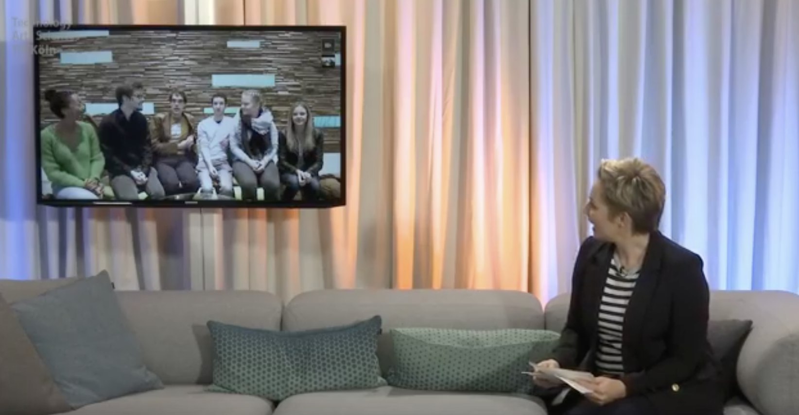
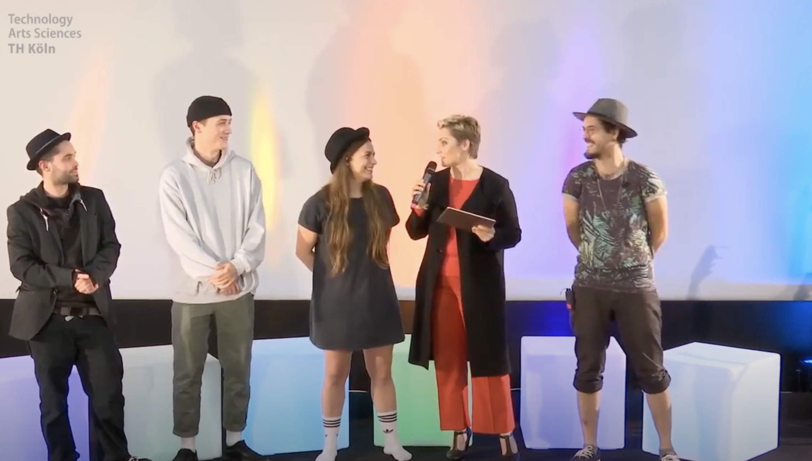
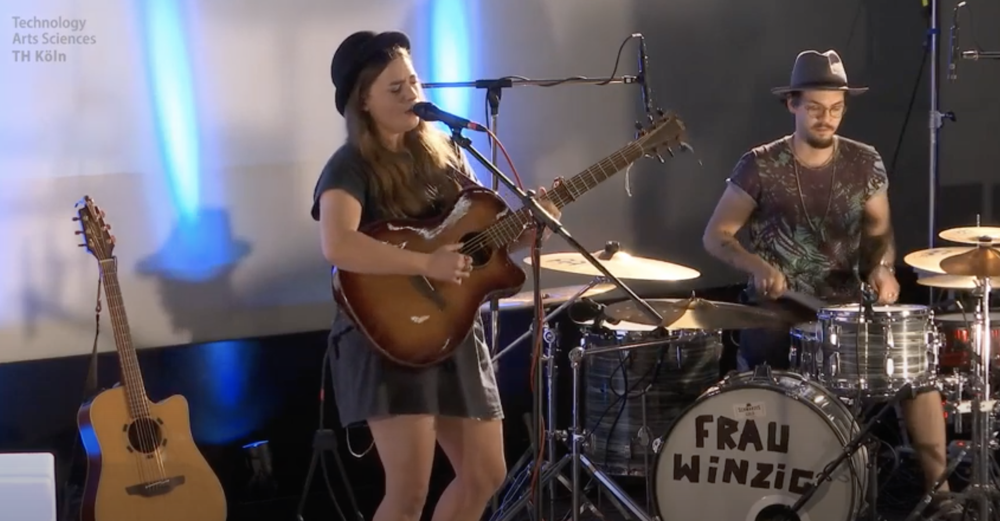

Im hochschuleignen Studio findet jedes Jahr das Modul "Studioproduktion – Live" von Prof. Hans Kornacher statt.
Dabei  soll eine professionelle Fernseh-Live-Sendung möglichst realitätsnah  simuliert werden. Mit allem was dazugehört; eine
professionelle Moderatorin (Janine Steeger) begleitet den Zuschauer durch die Sendung. Das Kamerateam muss stets den besten
Bildausschnitt finden und halten. Das Ton-Team passt am Audiomischer auf, dass alle Töne sitzen. 
Das  technische Department sitzt zwischen unzähligen Monitoren und einem Bildmischer und fügt entsprechend
der Regieanweisungen das passende Bild mit dem passenden Ton zusammen und schickt es raus an die Zuschauer.
Studiogäste müssen von der Aufnahmeleitung  zur richtigen Zeit am richtigen Ort platziert werden.
Über YouTube wurde die Sendung live gestreamt.

Der größte Teil der Arbeit ist während der Sendung nicht zu sehen: sich mit technischen Geräten auseinanderzusetzen, die 
vorher noch nie benutzt wurden.  
 
 Mit handwerklichem Geschick, unter Einsatz von hohen Leitern und mit entsprechender
 Lichttechnik das Studio in ein ansehnlichen Zustand zu bringen:

Studio vorher.

Studio nachher.

Bildausschnitt in der Sendung.

 
Vorletztes Jahr fand die Sendung ausnahmsweise in einem Kino statt. 

 
und Frau Winzig begleitete die Sendung mit toller Musik.

# Studioproduktion während Corona
Aufgrund der Pandemie konnte die Studioproduktion nicht wie gewohnt stattfinden. 
Die intensive Zusammenarbeit auf teils wenigen Quadratmetern würde gegen die Auflagen
verstoßen. Um das Erlangen ähnlicher Kompetenzen zu ermöglichen,
wurde die Studioproduktion in kleinere Events zerteilt: kleine Teams streamen eigene Projekt, 
erstellen mit Hilfe der Lehrenden
 ein inhaltliches und technisches Konzept. Gezielte Inputs halfen bei der
  Ausgestaltung der Inhalte unterschiedlicher Departments. Pünktlich zum festgelegten Termin wurde gestreamt.
  Auch innerhalb der kleineren Projekte waren nach wie
 vor unterschiedliche Fähigkeiten gefragt: Bedienung und Einrichtung von Kameras, Ton, Koordination der Teilnehmer,
  Erstellung von Grafiken, Moderation, Bespielung von Social Media-Kanälen.
 

## Bachelor of Gaming  
 
 
Bei der Konzeptidee „Bachelor of Gaming“ werden in einer Gameshow  
zwei Kandidaten gegeneinander antreten, um am Ende der Show den 
Studiengang mit dem "Bachelor of Gaming" abzuschließen. 
Dabei werden insgesamt 6 Spiele gespielt, wobei jedes Spiel ein
 Semester im Studium repräsentiert. Nach den 6 Spielen kommt 
 es zur Abschlussprüfung. 
   Bachelor of Gaming   von Methusshan	Elankumaran  und Enes Yilmaz 
  

## Ratebakel
 

Bei der Konzeptidee „Ratebakel“ werden zwei
 Kontrahenten zufällig ausgewählte Youtube-Videos
  anschauen und die Anzahl der Aufrufe erraten.
   Je nach Art des Erfolgs, werden dann Punkte verteilt.
   Der Verlierer muss eine  ganze Chili – "ohne Beilage" – esssen.
     Ratebakel von Thilo Schenkelberg und  Christopher Schmitz
     

## BCN - Jugend und Politik Oberberg 
                                     

Fünf engagierte Nachwuchspolitiker diskutieren
 über aktuelle,
politische Themen.  
 Jugend und Politik Oberberg   von Christopher Waffler, Niklas Groß und Burak Köse 
  

