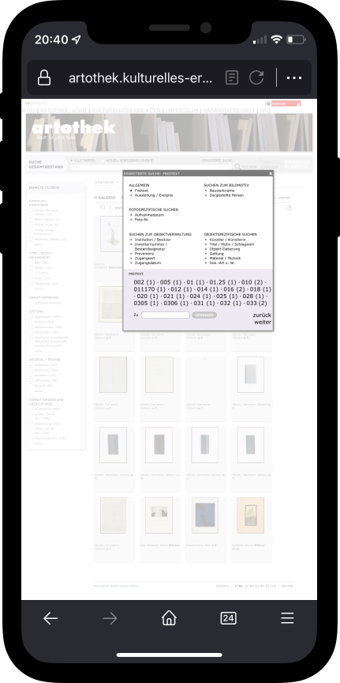
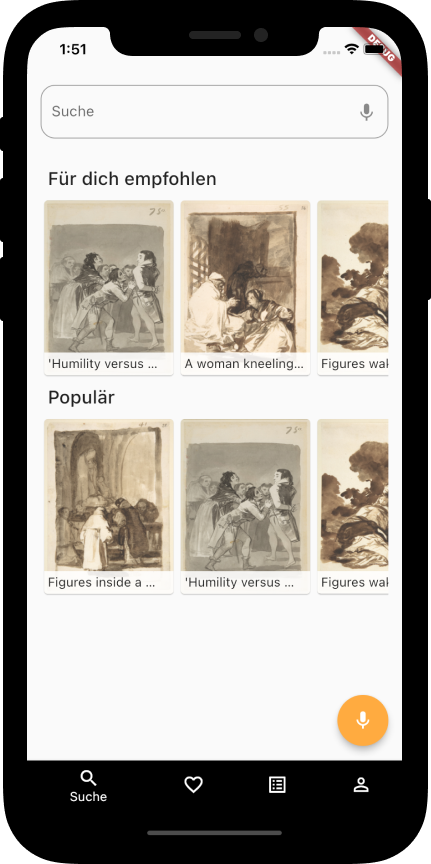
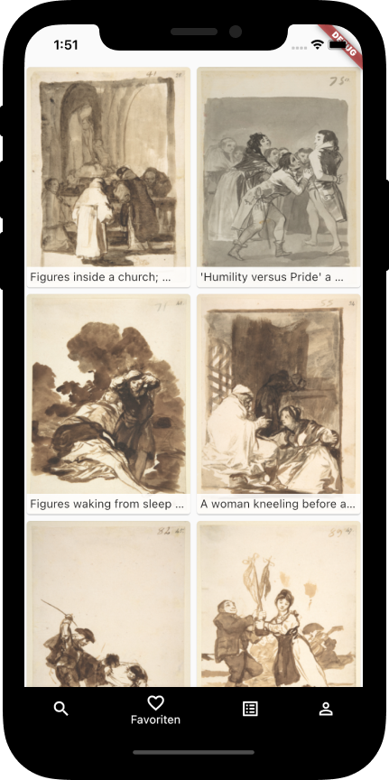
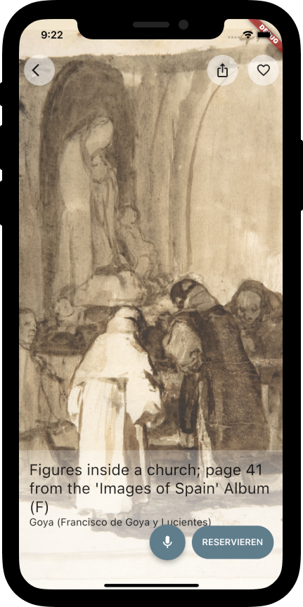

Das Modul *Entwicklungsprojekt* vom Wintersemester 2021/2022 hat einige besondere Projekte hervorgebracht, darunter auch das Projekt
*Artothek*, von Liana Kwint und Julian Schiller.

## Artothek --- Einleitung

*Die artothek –-- Raum für junge Kunst bietet neben der Ausleihe zeitgenössischer Kunst einen Ort für Ausstellungen Kölner Künstler sowie internationaler Gäste. Ziel ist die Förderung und Vermittlung junger Kunst* - Webseite Artothek

Der institutionelle Service der Artothek versteht sich als Angebot kultureller Bildung an alle Bürger\*innen. Ein erklärtes Ziel der Artothek ist es, die Barrieren im Zugang zu Kunst zu senken. Das Projekt soll dabei eine unterstützende Rolle einnehmen, in dem es dieses Ziel auf den digitalen Raum überträgt.

Daher widmet sich das Projekt der Frage, **wie sich die Zugänglichkeit** (im Sinne der ISO9241-210) **zu dem bestehenden Service der Artothek Köln verbessern lässt**.

## Problemraum

### Anfangszustand

Der Service der Artothek teilt sich auf zwei Seiten:
1. Homepage (Landing Page)
2. Online-Katalog,  mit Abbildungen der ausleihbaren Werke

Zugänglichkeit dabei reduziert durch:
1. kein einheitliches Design zwischen den beiden Seiten (Gebrauchstauglichkeit gesenkt, Stichwort Mentale Modelle)
2. kein ausreichendes Feedback bei der Nutzung des Services
3. keine Unterstützung
4. schlechte Strukturierung
5. Nutzung von mobilen Endgeräten eingeschränkt

Aktuelle Website der Artothek:  
<https://www.museenkoeln.de/artothek/seite.aspx?s=542>  
Aktuelle Website des Online-Katalogs:  
<https://artothek.kulturelles-erbe-koeln.de/>

### Zielzustand
- Verbesserung der Nutzbarkeit und Bedienbarkeit der Homepage und des Online Katalogs
- Reduzierung des Aufwandes und der Barrieren bei Reservierung und Ausleihe eines Werkes

### Methodischer Rahmen
- Vorgehensmodell: Rapid Contextual Design (RCD, Karen Holtzblatt)
- dabei Erfassung des Anfangszustands u.a. mit Contextual Inquiries und Affinity Diagram
- Im gesamten Prozess ergänzend zu RCD: Methoden, die mensch-zentrierte Gestaltung ermöglichen nach ISO 9241-210

## Lösungsraum

### Lösungsansätze
Folgende Lösungsansätze wurden erarbeitet und implementiert:
- Landing Page und Online-Katalog sind in einem Endpunkt zusammengefasst
- Möglichkeit zur Sprachsteuerung
- Einführung von Methaphern bei der Bedienung (z.B. Liken = ♥)
- eine Recommendation Engine (Empfehlungen für Nutzer\*innen auf Basis von Favoriten)
- die Möglichkeit, den Service von verschiedenen Endgeräten zu nutzen

### Evaluation des Prototypen
- Evaluation durch Retrospective Think Aloud (RTA) mit zwei Nutzern\*innen?
- Evaluation durch quantitative Auswertung der
	1. Anzahl der Fehler bei der Interaktion
	2. Anzahl der aufgetretenen Probleme in Bezug auf Layout, Terminologie, Navigation und Feedback
	3.  Zeit für die Aufgabenerfüllung
- Ergebnis: Weiterentwicklung im Bereich Layout, Terminologie und Navigation notwendig.

 Artothek Prototyp

## Fazit und Ausblick
 
Dank des entworfenen Prototyps gelang es, dem Ziel „Barrieren im Zugang zu Kunst senken“ näher zu kommen - begonnen im digitalen Raum.

Annäherung durch:
- Verbesserung der Zugänglichkeit (einheitliches Design zwischen Landing Page und Online-Katalog, Verwendung von Metaphern, Recommendation Engine)
- Reduzierung des Aufwandes bei Reservierung und Ausleihe eines Werkes (Möglichkeit zur Sprachsteuerung und zur Nutzung von verschiedenen Endgeräten)

### Ausblick
- Weiterentwicklung des Prototyps hinsichtlich Layout, Terminologie und Navigation notwendig
- Erhebung vergleichbarer Daten des Anfangs- und Zielzustandes (mit größerer Stichprobe)
- Erweiterung des Feedback und Unterstützung durch das System, sowie weitere einheitliche Strukturierung

## Quellen
[Github Repo zum Projekt](https://github.com/JJJS777/EPWS2122KwintSchiller)

