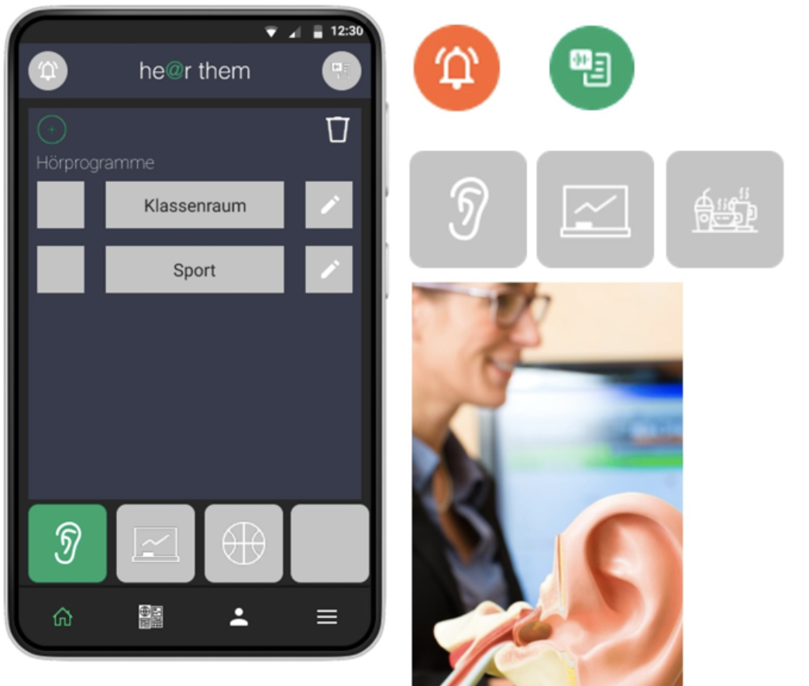
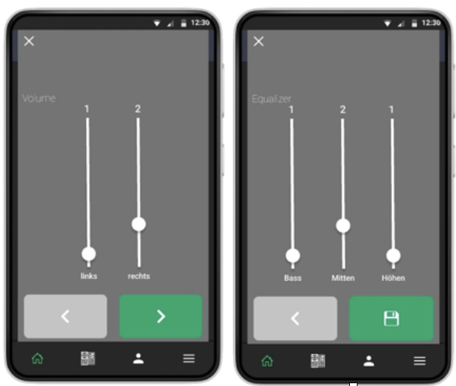

Unter dem Subtitel *He@r them* hat
Katharina Mundt ihr Projekt
im Wintersemester 2021/22 im Rahmen des Moduls *Entwicklungsprojekt* umgesetzt.

Kommunikation und Interaktion von hörbehinderten Schüler*innen und Student*innen
im Unterricht sind mit zahlreichen Barrieren verbunden, die für Normalhörende
unsichtbar sind. Die konzipierte App “ he@r them ” soll Barrieren überwinden helfen

## Hintergrund

Die UN
Behindertenrechtskonvention
formuliert das Recht von Menschen mit
Behinderungen auf lebenslange inklusive
Bildung. Hörbehinderte Menschen sind
trotz technischer Hilfsmittel wie zum
Beispiel Hörgeräten in ihrer
Kommunikation mit anderen Menschen
vielen Unsicherheiten und Problemen
ausgesetzt. Ziele der vorliegenden Arbeit:
Identifikation von Barrieren und
Konzeption einer adaptiven
Userunterstützung mit einer App.

 

## User Unterstützung
Die Anwendung läuft auf den Smartphones der Mitschüler:innen von hörbehinderten Schüler:innen und
dient einerseits als Mikrofon für das Gesprochene der Mitschüler:innen und wird per Text-to-Speech
an das Smartphone der/des hörbehinderten Schüler:in gesendet.
Hörbehinderte Schüler:innen können ein Signal an alle senden, falls es zu Schwierigkeiten kommt.
Zudem können optimale Hörgeräteeinstellungen individuell für unterschiedliche, akustische Raumsituationen
(Indoor, Outdoor, Störschall, Störgeräusche etc.) eingestellt und gespeichert werden.

### Smart Hearing
Hörgeräteeinstellung mit der App,
erweiterbar um Nutzung von Künstlicher
Intelligenz. Individualisierbar auf jede
Raumsituation.

### Signal
Benachrichtigung der Unterrichts
teilnehmer mit visuellem Signal in der
App.

### Speech to Text
Transfer der gesprochenen Sprache
mittels künstlicher Intelligenz,
erweiterbar durch Sprecherkennung.

## Fazit
Inklusion für hörbehinderte Schüler lässt
sich mit Hilfe einer App und der
adaptiven Userunterstützung durch
Künstliche Intelligenz, Signalfunktionen
und individuell auf die Raumsituation
einstellbaren Hörgeräten per App
deutlich verbessern. Damit kann eine
Lösung geschaffen werden, die durch
weitere Funktionen zu einer integrativen
für alle Schüler*innen und Student*innen
nutzbaren Lösung ausgebaut werden
kann.

 

