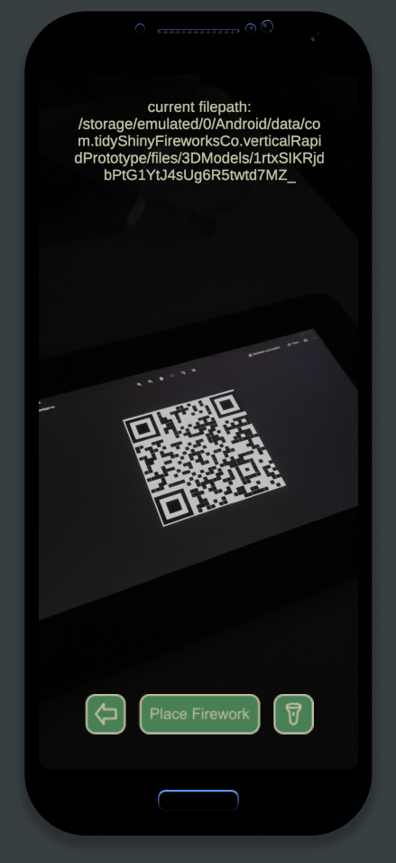
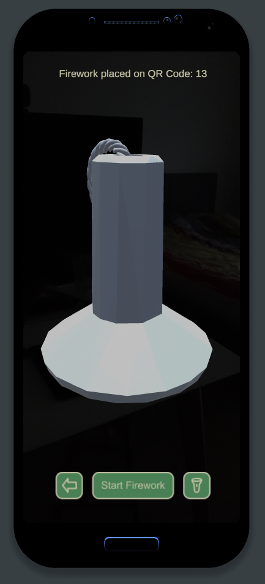
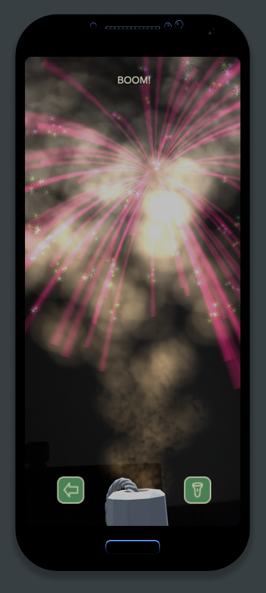
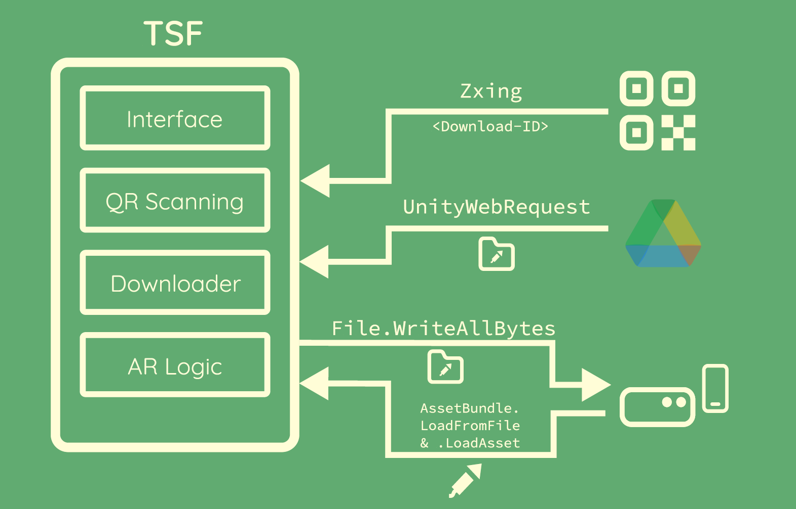

Unter dem Subtitel *An environmentally friendly way to appreciate fireworks!* haben
Paul André Johne und Kevin Repke
im Wintersemester 2021/22 im Rahmen des *Entwicklungsprojekt* Moduls das Projekt
*Tidy Shiny Fireworks* umgesetzt.

## Die Problemdomäne

Die Belastung des Klimas nimmt in der heutigen Zeit mehr an Bedeutung
zu. Neue Maßnahmen müssen entworfen und Technologien eingesetzt
werden, um die Zerstörung des Ökosystems zu verhindern bzw. zu
minimieren. Vor allem in Bezug auf das Silvester-Feuerwerk 2019/2020 sind einige neue
Maßnahmen umgesetzt worden wie z.B. in Deutschland ein Verkaufsverbot von
Feuerwerk und in Amsterdam das private Raketen- und Böllerverbot. Auch
wenn diese eigentlich im Hinblick auf die COVID-19 Pandemie beschlossen
wurden um die Krankenhäuser zu entlasten, sind positive Effekte
wahrzunehmen, wie die Einsparung bei der Feinstaubbelastung oder der
Verringerung des Müll-Aufkommens um ca. 3500 Tonnen in Deutschland.
Nun, da sich die Pandemie dem Ende nähert, werden Überlegungen angestrengt,
ob gewisse Maßnahmen in den nächsten Jahren weiter fortgesetzt oder
alternative Technologien genutzt werden sollen, um die Vorteile weiter
ausschöpfen zu können oder auszubauen.

## Unsere Lösung

Mit der App **Tidy Shiny Fireworks** soll es mit Augmented Reality möglich
sein, Feuerwerk auf dem Smartphone anzeigen zu lassen. Dafür werden
Feuerwerksmodelle über QR Codes bereitgestellt, die der Nutzer über den
integrierten QR Scanner herunterladen kann. In der AR-Szene wird dann der
besagte QR Code auch als Referenzpunkt für das Modell benutzt, welches
daraufhin gestartet werden kann.

Die App kann bei öffentlichen oder
privaten Veranstaltung genutzt werden, z.B. im Stadtzentrum am
Silvesterabend im Form einer Stadtfeier, die von der Stadt organisiert wird.


 

## Die Architektur

Die App lässt sich in 4 Bestandteile aufteilen. Das „Interface“ kümmert sich
um die Navigation in den Screens. Das „QR Scanning“ benutzt Zxing, um
auf den Inhalt des QR Codes zuzugreifen, welcher für das Downloaden des
AssetBundles mit dem Feuerwerk mittels UnityWebRequest nötig ist. Die
„AR Logic“ sorgt für das Abspeichern des Bundles und kann jederzeit auf
dessen Inhalt zugreifen, um schlussendlich das Feuerwerk in der Szene zu
platzieren.

## Unser Ziel

Die Bereitstellung der App für Veranstaltungen jeglicher Art soll einen
Ausgleich zu den Restriktionen von Feuerwerk besonders für urbane
Regionen schaffen. Eine umweltfreundliche und der Gesundheit nicht
schadende Alternative solcher Art soll es ermöglichen, weiterhin die
„Feuerwerkstradition“ in abgewandelter Form genießen zu können, ohne
dabei Feinstaubpartikel in die Luft zu schießen und zugleich die Lautstärke begrenzt zu
halten und keinen Müll zu produzieren.

## Quellen

[Github Repo zum Projekt](https://github.com/Paul-Johne/TidyShinyFireworks_full-version)

