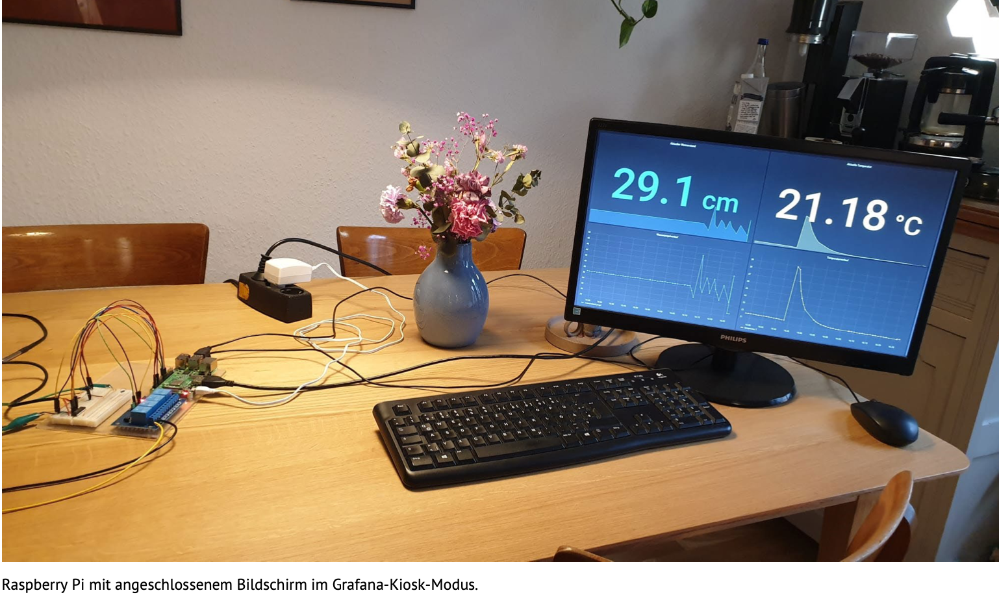
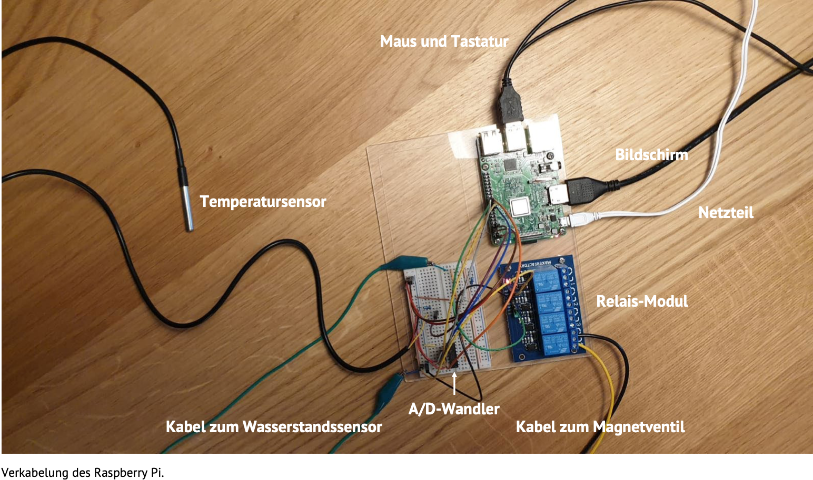
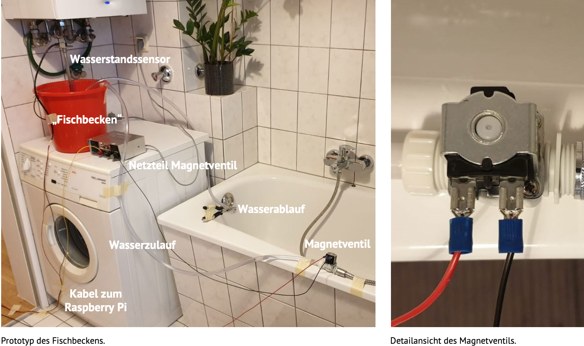
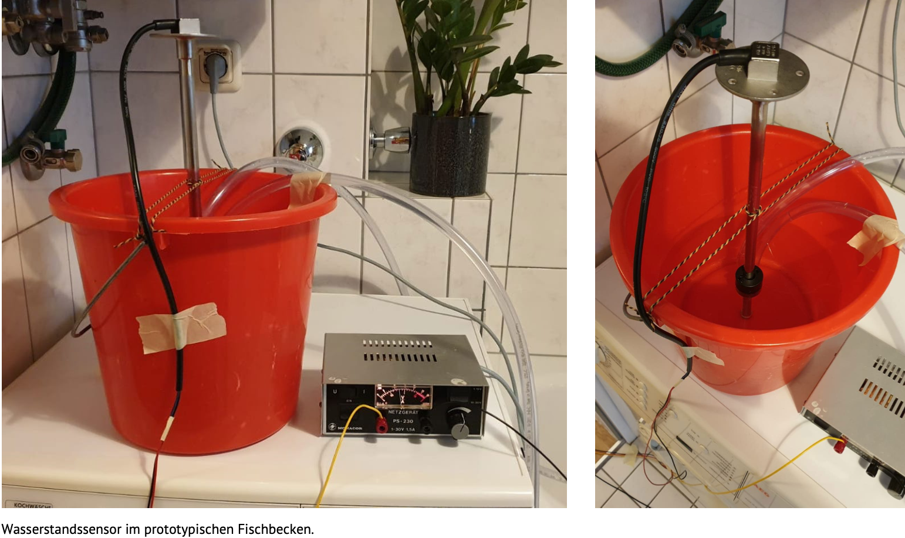

Innerhalb des Moduls "Entwicklungsprojekt" wird
die Konzeption und prototypische Realisierung
eines interaktiven Systems durchgeführt.

Das Projektziel von Verena Heissbach und Anne Germund  ist:

### Es soll ein System zur Überwachung von Aquaponikanlagen entstehen, welches den Betrieb, die Kontrolle und Wartung erleichtert und somit die Gesamtsicherheit erhöht.

Der Begriff Aquaponik setzt sich zusammen aus „Aquakultur“ – die vom Menschen betriebene Fischzucht – und „Hydroponik“, dem Anbau von Pflanzen in erdlosen Kulturen.1 Es handelt sich um eine Kombination von Fisch- und Pflanzenzucht, die sich aufgrund des gemeinsamen Wasserkreislaufs durch einen deutlich verringerten Wasserverbrauch auszeichnet und eine zusätzliche Düngung überflüssig macht.2 Im Rahmen eines Lehrprojekts des Instituts für Biologiedidaktik der Universität zu Köln entstand im Jahr 2017 eine kleine Aquaponikanlage, welche jedoch infolge des zeitlichen und organisatorischen Aufwands für die täglichen Kontrollen außer Betrieb genommen wurde.

### Zielsetzung
Im Rahmen des Entwicklungsprojekts soll der funktionale Prototyp eines Systems aus Sensoren und einem Raspberry Pi entstehen, welches das Durchführen der Messungen von Temperatur und Wasserstand übernimmt und die Anlagenbetreiber*innen bei kritischen Messwerten alarmiert. Zusätzlich soll das System angemessen auf diese Messwerte reagieren können und beispielsweise die Wasserzufuhr starten.

### Material und Methoden
Die zentrale Schnittstelle des Systems bildet ein Raspberry Pi, an welchen ein Wasserstands- und Temperatursensor angeschlossen sind. Die Umwandlung der analogen Wasserstandsdaten in für den Raspberry Pi geeignete digitale Daten übernimmt ein A/D-Wandler. Zusätzlich ist ein Relais-Modul installiert, das die Schaltung des Magnetventils für die Wasserzufuhr bei zu niedrigem Wasserstand reguliert.
Die in regelmäßigen Abständen eingelesenen Daten werden in einer Influx- Datenbank gespeichert und auf einem Grafana-Dashboard visualisiert. Darüber hinaus wird der Dienst Pushbullet verwendet, welcher registrierte Nutzer*innen bei kritischen Messwerten und Aktivitäten des Systems per Push-Benachrichtigung informiert. Das Dashboard wird im Grafana-Kiosk- Modus auf einem angeschlossenen Bildschirm angezeigt und kann zusätzlich im lokalen Netz über die IP-Adresse des Raspberry Pi und den zugehörigen Port im Browser aufgerufen werden.

### Ergebnisse und Ausblick
Der beschriebene Aufbau läuft stabil und erfüllt die zu Beginn formulierte Zielsetzung zuverlässig. Im Laufe des Projekts taten sich jedoch ein paar Schwierigkeiten auf, die zum Teil mit alternativen Ansätzen bereits gelöst werden konnten oder in einem Folgeprojekt adressiert werden sollen. Als größtes Problem stellte sich bereits zu Beginn die Kompatibilität der Hardware-Komponenten heraus, da die Sensorik über eine zu feine Messauflösung verfügte. Mit neuen Sensoren konnten diese Schwierigkeiten erfolgreich gelöst werden.

In einem nächsten Schritt wäre es wünschenswert, den aktuellen Aufbau am finalen Einsatzort zu installieren und einen Zugriff auf das Grafana- Dashboard auch von außerhalb des lokalen Netzes zu ermöglichen, um die Kontrolle der Anlage weiter zu vereinfachen.

#### Quellen
1 Rücker, T. (2012). Aquaponik im Eigenbau : zum Anfassen, Mitmachen und Erleben! Gesunde Ernährung - nicht nur als Krisenvorsorge für Selbstversorger -. Berlin: Selbstverl.

2 Bernstein, S. (2011). Aquaponic gardening: a step-by-step guide to raising vegetables and fish together. New society publishers.

Text und Bild von: Vanessa Heissbach, Anne Germund

