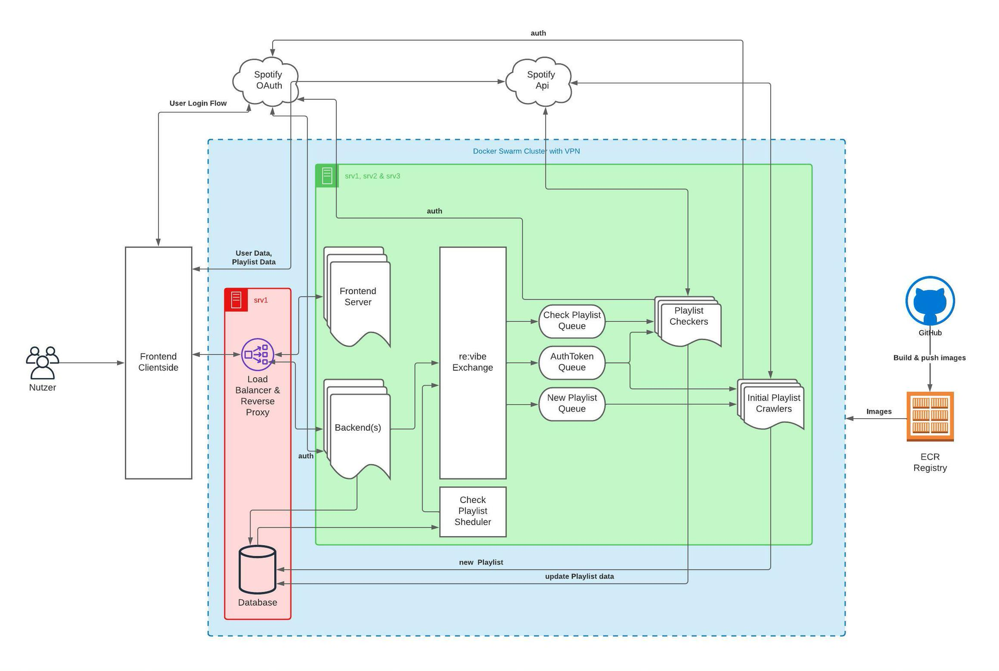

Innerhalb des Moduls "Entwicklungsprojekt" wird
die Konzeption und prototypische Realisierung
eines interaktiven Systems durchgeführt.

Das Projektziel von Verena Heissbach und Anne Germund  ist:

### Es soll ein System zur Überwachung von Aquaponikanlagen entstehen, welches den Betrieb, die Kontrolle und Wartung erleichtert und somit die Gesamtsicherheit erhöht.

Der Begriff Aquaponik setzt sich zusammen aus „Aquakultur“ – die vom Menschen betriebene Fischzucht – und „Hydroponik“, dem Anbau von Pflanzen in erdlosen Kulturen.1 Es handelt sich um eine Kombination von Fisch- und Pflanzenzucht, die sich aufgrund des gemeinsamen Wasserkreislaufs durch einen deutlich verringerten Wasserverbrauch auszeichnet und eine zusätzliche Düngung überflüssig macht.2 Im Rahmen eines Lehrprojekts des Instituts für Biologiedidaktik der Universität zu Köln entstand im Jahr 2017 eine kleine Aquaponikanlage, welche jedoch infolge des zeitlichen und organisatorischen Aufwands für die täglichen Kontrollen außer Betrieb genommen wurde.

### Problemraum
Playlists mit einer hohen Followerzahl von Spotify, aber auch von Musiklabels oder Nutzern, werden von Zeit zu Zeit geändert und es werden Songs hinzugefügt oder entfernt. Als Nutzer, der solche einer Playlist folgt, hat man keine Möglichkeit vorherige Versionen der Playlist abzurufen oder zu sehen, was genau sich geändert hat. So kann es passieren, dass man bestimmte Songs verliert, da man sie nicht individuell gespeichert hat, oder einen bestimmten Stand einer Playlist verliert, welcher gerade perfekt für einen war (Songs und Reihenfolge).
### Zielsetzung
Das Ziel dieses Projektes war es, eine Plattform für bestehende Spotify Nutzer zu schaffen, welches es ermöglicht große öffentliche, aber auch konkrete private, Playlists tracken zu lassen. Die Plattform sollte den Nutzern die Möglichkeit bieten frühere Versionen von Playlists abrufen zu können und diese mit einer beliebigen anderen Version der Playlist vergleichen zu können. Wenn der Nutzer eine Version einer Playlist übernehmen möchte, sollte er die Möglichkeit haben, diese automatisch innerhalb seines eigenen Spotify Accounts zu speichern.
### Systemaufbau
Ein großes Thema bei der Umsetzung des Projekts sind Microservices. Da das System aus vielen Funktionen besteht, werden Microservices genutzt um ein verteiltes System aufzubauen, bei dem ein Service jeweils nur eine Aufgabe übernimmt.  Das Projekt besteht aus einem Frontend Server, Backend Server, Playlist Screener, Playlist Crawler, Scheduler und einer NoSQL Datenbank.   Diese Services sind horizontal skalierbar und werden mit Hilfe von Docker Swarm über drei individuelle Server hinweg orchestriert. Mit dem AMQP Messaging Service, RabbitMQ können Aufträge an die Services gesendet werden und Daten ausgetauscht werden. So entsteht ein skalierbares System mit autonomen Services statt einem großen monolithischen System, sodass Services unabhängig voneinander geupdatet oder verändert werden können. Alle Services, bis auf den Backend Server und die Datenbank, sind mit der Spotify API verbunden. Das Backend braucht keinen Zugriff auf die API, da darüber nur Aufgaben and die Services gestellt werden oder die Datenbank abgerufen wird.     
In einem nächsten Schritt wäre es wünschenswert, den aktuellen Aufbau am finalen Einsatzort zu installieren und einen Zugriff auf das Grafana- Dashboard auch von außerhalb des lokalen Netzes zu ermöglichen, um die Kontrolle der Anlage weiter zu vereinfachen.

### Architekturdiagramm

