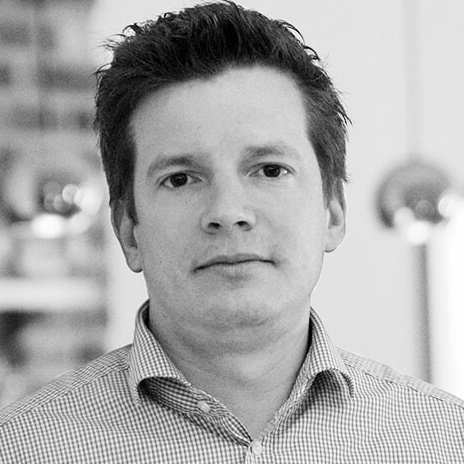

Was könnte ich denn als Praxisprojekt machen? Und als Bachelorarbeit oder Masterthesis? Vielleicht mal ein Projekt mit einem externen Partner? Um Antworten auf diese oder ähnliche Fragen zu bekommen, findet in diesem Jahr wieder die Medieninformatik Kontaktbörse statt. Die Veranstaltung richtet sich an Bachelor- und Masterstudierende auf der Suche nach einem Thema für ihr Abschlusssemester. Die Veranstaltung hilft Ihnen, sich früh in Richtung Praxisprojekt und Abschlussarbeit zu organisieren, sprich: mögliche Themenfelder abzustecken, Kooperationspartner zu finden, etc.

Zu dieser Veranstaltung haben wir Unternehmen und Organisationen eingeladen, die ihre Themen- und Problemfelder vorstellen und Unterstützung aus der Medieninformatik gebrauchen könnten.

<figure class="mi-teaser-speaker speaker">
    
    <figcaption>
        <ul class="speaker-about-list">
            <li class="speaker-name"><h3>moxd lab / TH Köln</h3></li>
            <li>gjuce GmbH, Köln, E-Commerce</li>
            <li>Sucht Frontend- und Backend-Entwickler:innen für Online-Shops und Custom-Projekte. Beispiele möglicher Abschlussprojekte:  
                <ul>
                    <li>Innovativer Product-Guide für den Online-Weinhandel mit Fokus auf Konzeption / UX / Frontend-Entwicklung</li>
                    <li>Intelligentes Produkt-Empfehlungs-Modul für einen Freizeitsport-Händler mit Fokus auf klassische und KI-gestützte Daten-Analyse und Backend-Entwicklung</li>
                </ul>
            </li>
        </ul>
    </figcaption>
</figure>

<figure class="mi-teaser-speaker speaker">
    
    <figcaption>
        <ul class="speaker-about-list">
            <li class="speaker-name"><h3>Prof. Dr. Matthias Böhmer</h3></li>
            <li>moxd lab / TH Köln</li>
            <li>Sucht Support in den Bereichen Mobile, IoT, Interaction & HCI für verschiedene Forschungsprojekte.</li>
        </ul>
    </figcaption>
</figure>

<figure class="mi-teaser-speaker speaker">
    

        
        
    

    <figcaption>
        <ul class="speaker-about-list">
            <li class="speaker-name"><h3>Lena Wirtz & Chiara Schmeis</h3></li>
            <li>adesso SE, Dortmund, IT-Consulting</li>
            <li>Brauchen Unterstützung im Bereich Change Management, UX in agiler Produktentwicklung sowie Marketing Automation & Customer Experience</li>
        </ul>
    </figcaption>
</figure>

<figure class="mi-teaser-speaker speaker">
    

        
        
    

    <figcaption>
        <ul class="speaker-about-list">
            <li class="speaker-name"><h3>Andreas Heisterkamp & Karsten Roth</h3></li>
            <li>Hans Peter Esser GmbH, Kürten, Medizintechnik</li>
            <li>Suchen Web-Entwickler:innen und -Designer:innen (Frontend, Backend, Datenbanken) für:
                <ul>
                    <li>App-Entwicklung</li>
                    <li>VR-/AR-Entwicklung</li>
                    <li>Entwicklung von internen Tools, um Abläufe zu verbessern / automatisieren </li>
                </ul>
            </li>
        </ul>
    </figcaption>
</figure>

<figure class="mi-teaser-speaker speaker">
    
    <figcaption>
        <ul class="speaker-about-list">
            <li class="speaker-name"><h3>Till Martensmeier</h3></li>
            <li>Busch-Jaeger Elektro GmbH, Elektroinstallation vom Schalter bis zum Smart-Home-System</li>
        </ul>
    </figcaption>
</figure>

---

Mit einigen Unternehmen laufen noch die letzten Absprachen, falls sich hier noch was ergibt, sagen wir über diese Seite Bescheid 😉.

Außerdem wird das [Advanced Media Institute](https://www.th-koeln.de/informatik-und-ingenieurwissenschaften/advanced-media-institute_69153.php) einige Themenfelder im Rahmen der aktuellen Forschungsprojekte vorstellen, denn hier gibt es neue Förderung für das [Cranach Digital Archive](https://lucascranach.org) und ein neues gefördertes AR-Projekt in Kooperation mit der Volkshochschule des Oberbergischen Kreises.
