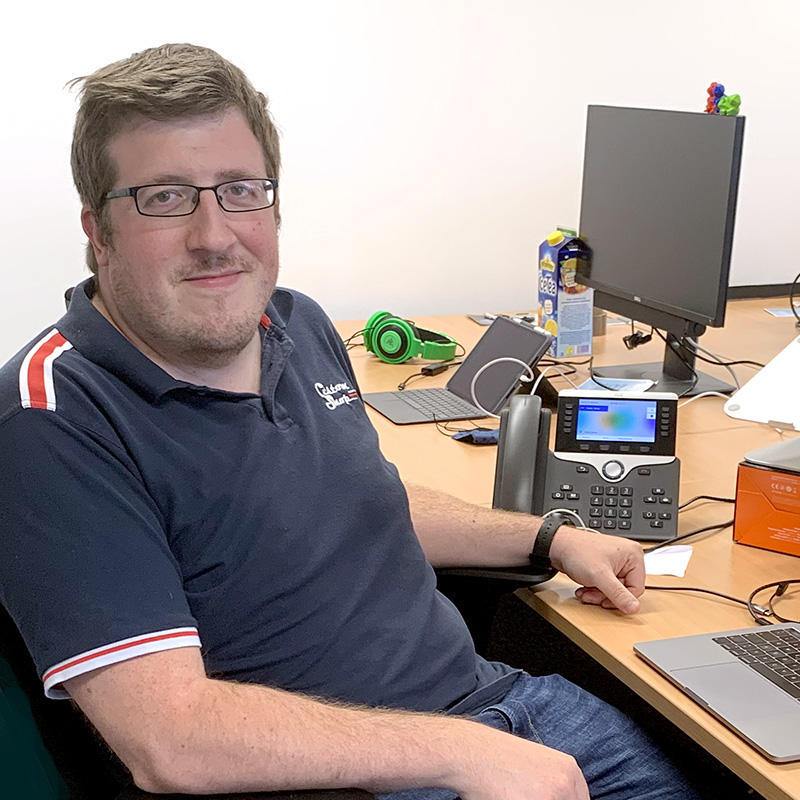
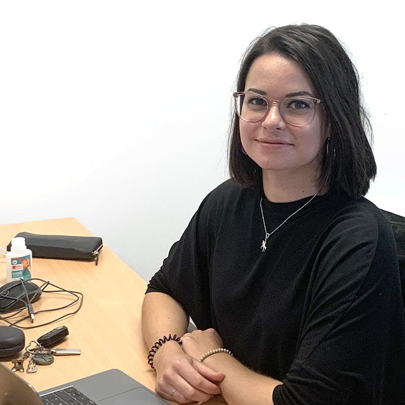

+++
date = "2016-11-05T21:05:33+05:30"
title = "Medieninformatik Mentoren"
linkTitle = "Study"
+++

  
  

Bei Fragen und Problemen im und rund um das Medieninformatik Studium stehen die Medieninformatik Mentoren <a href="https://www.th-koeln.de/personen/nathalie_michelle_severine.kuhn/">Nathalie Kuhn</a> und <a href="https://www.th-koeln.de/personen/mario.faske/">Mario Faske</a> mit Rat, Tat und einem offenen Ohr zur Verfügung. Beide haben den <a href="/study/bachelor/">Medieninformatik Bachelor</a> absolviert und studieren derzeit im <a href="/study/master/">Medieninformatik Master Studiengang</a>. Gleichzeitig sind sie Wissenschaftliche Mitarbeiter im <a href="https://www.th-koeln.de/informatik-und-ingenieurwissenschaften/advanced-media-institute_69153.php">Advanced Media Institute</a> und kennen somit das Studium von «beiden» Seiten. 

