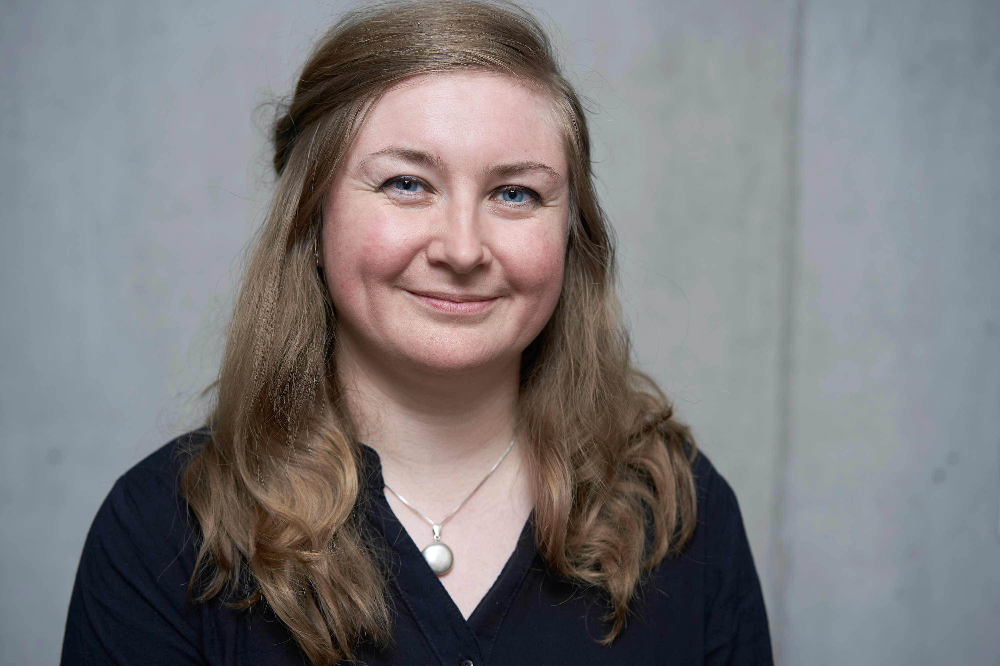
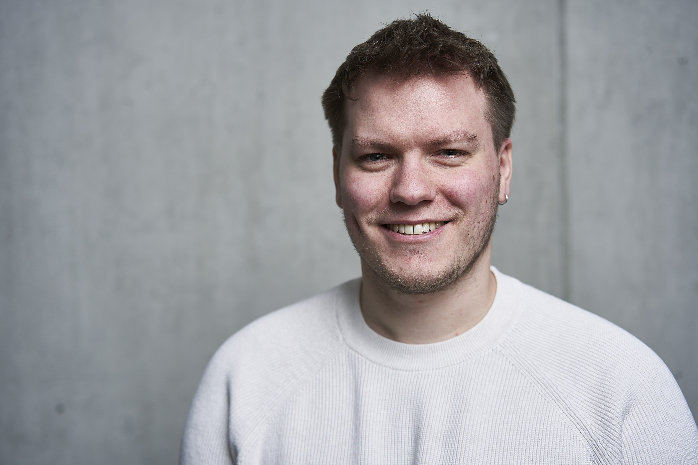

+++
date = "2024-03-16T21:05:33+05:30"
title = "Medieninformatik Mentoren"
linkTitle = "Study"
+++

  
  

Bei Fragen und Problemen im und rund um das Medieninformatik Studium stehen die Medieninformatik Mentoren <a href="https://www.th-koeln.de/personen/ernestine.wassermann/">Ernestine Wassermann</a> und <a href="https://www.th-koeln.de/personen/simon_ludwig.schulte/">Simon Schulte</a> mit Rat, Tat und einem offenen Ohr zur Verfügung.

Ernestine hat sowohl den <a href="/study/bachelor/">Medieninformatik Bachelor</a> als auch den <a href="/study/master/">Medieninformatik Master</a> Studiengang absolviert. Simon hat den <a href="/study/bachelor/">Medieninformatik Bachelor</a> absolviert und studiert gerade im <a href="/study/master/">Medieninformatik Master </a>Studiengang. Gleichzeitig sind beide Wissenschaftliche Mitarbeiter im <a href="https://www.th-koeln.de/informatik-und-ingenieurwissenschaften/advanced-media-institute_69153.php">Advanced Media Institute</a> und kennen somit das Studium von «beiden» Seiten. 

